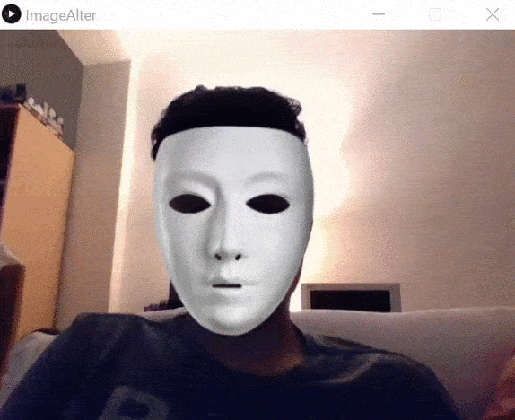

# FakeMask
Mascara falsa.
<!-- PROJECT LOGO -->
 

  <h3 align="center">Máscara falsa</h3>

  

    ¡Ponte una máscara!
     
      <a href="https://github.com/carlosepb/FakeMask"><strong>Explorar repositorio»</strong></a>
     
     
      <a href="https://github.com/carlosepb/FakeMask/blob/main/gifCarlos.gif">Ver Demo</a>
      ·
      <a href="https://github.com/carlosepb/FakeMask/issues">Reportar Error</a>
      ·
      <a href="https://github.com/carlosepb/FakeMask/issues">Solicitar Colaboración</a>
    

  

<!-- TABLE OF CONTENTS -->

  
Tabla de Contenido

  <ol>
    <li>
      <a href="#sobre-el-proyecto">Sobre el Proyecto</a>
      <ul>
        <li><a href="#herramientas-de-desarrollo">Herramientas de Desarrollo</a></li>
      </ul>
    </li>
    <li><a href="#trabajo-realizado">Trabajo Realizado</a></li>
    <li>
      <a href="#empezando">Empezando</a>
      <ul>
        <li><a href="#prerrequisitos">Prerrequisitos</a></li>
        <li><a href="#instalación">Instalación</a></li>
        <li><a href="#ejecutar">Ejecutar</a></li>
      </ul>
    </li>
    <li><a href="#hoja-de-ruta">Hoja de Ruta</a></li>
    <li><a href="#licencia">Licencia</a></li>
    <li><a href="#contacto">Contacto</a></li>
    <li><a href="#agradecimientos">Agradecimientos</a></li>
  </ol>

<!-- ABOUT THE PROJECT -->
## Sobre el Proyecto

Aplicación desarrollada en Processing 3 que hace uso de la cámara de tu portátil para ponerte una máscara, en este caso disponemos de 3 distintas.
Para cambiar de máscara usaremos las teclas de flecha izquierda y flecha derecha.
En la imagen inferior podemos ver como la máscara seguirá el movimiento de nuestra cara aunque el nivel de luz sea bajo..(imagen_4.0)

 imagen_4.0

## Trabajo Realizado

Para la rotación de la figura sobre si misma se utilizan los eventos keypressed y released utilizados en la primera practica además de la función rotate(). Estas tres cosas combinadas nos permiten realizar modificaciones en la inclinación de la figura respecto al eje 0.

## Herramientas de Desarrollo

* [Processing3](https://processing.org/download/)

<!-- GETTING STARTED -->
## Empezando

Para modificar y ejecutar la aplicación necesitará instalar el entorno de desarrollo Processing3.

### Prerrequisitos

* Descargar y descomprimir Processing3, lo puedes encontrar [aquí](https://processing.org/download/).

### Instalación
1. Para exportar a un archivo con formato gif animado es necesario instalar GifAnimation, lo puede encontrar [aquí](https://github.com/extrapixel/gif-animation).
2. Para utilizar la libreria OpenVC deberemos descargarla e instalarla desde encontrar [aquí](http://www.magicandlove.com/blog/2018/11/22/opencv-4-0-0-java-built-and-cvimage-library/).

### Ejecutar

1. Proyecto.
    * Descomprimir rar.
    * Ejecutar Processin3.
    * Archivo->Abrir...

<!-- ROADMAP -->
## Hoja de Ruta

En este momento no hay planes de mejorar la aplicación.

<!-- LICENSE -->
## Licencia

Software completamente libre para copiar o distribuir.

<!-- CONTACT -->
## Contacto

Autor: Carlos Eduardo Pacichana Bastidas

Email: carlos.eduardo.pacichana@gmail.com  carlos.pacichana101@alu.ulpgc.es

Enlace al proyecto: [https://github.com/carlosepb/FakeMask](https://github.com/carlosepb/FakeMask)

<!-- ACKNOWLEDGEMENTS -->
## Agradecimientos
* [Processing](https://processing.org/)
* [Gif-animation](https://github.com/extrapixel/gif-animation)
* [Funprogramming](https://funprogramming.org/)
* [Text](https://processing.org/reference/text_.html)
* [Texturas](https://www.pexels.com/es-es/)
* [OpenVC 4.0.0](http://www.magicandlove.com/blog/2018/11/22/opencv-4-0-0-java-built-and-cvimage-library/)
